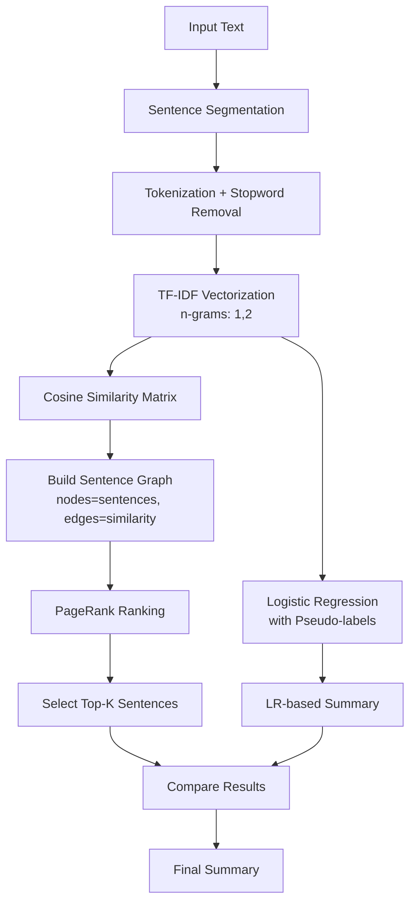
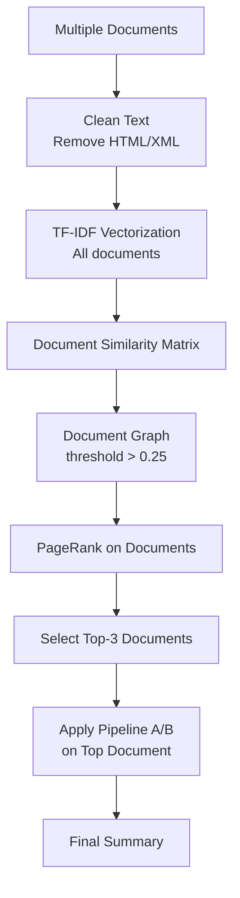

# 📚 Text Summarization System with Multi-Pipeline Approach

A comprehensive text summarization system combining **TF-IDF**, **TextRank**, and **Multi-Document Ranking** with machine learning classification and graph-based methods.

---

## 1️⃣ Mục Tiêu Bài Toán

### Định Nghĩa Vấn Đề
**Bài toán:** Tự động tóm tắt văn bản tiếng Việt và tiếng Anh, hỗ trợ cả single-document và multi-document summarization.

### Input/Output

| Loại | Mô Tả |
|------|-------|
| **Input** | • Single document: Một văn bản dài (tin tức, bài báo, tài liệu)<br>• Multi-document: Tập hợp nhiều văn bản liên quan |
| **Output** | • Tóm tắt extractive: 2-5 câu quan trọng nhất<br>• Với multi-document: Top văn bản quan trọng + tóm tắt |
| **Ngôn ngữ** | Tiếng Việt, Tiếng Anh |

### Ứng Dụng Thực Tiễn
- Tóm tắt tin tức tự động
- Tổng hợp thông tin từ nhiều nguồn
- Hỗ trợ đọc hiểu tài liệu dài

---

## 2️⃣ Phương Pháp Tiếp Cận

### Ý Tưởng Chính
Hệ thống sử dụng **3 pipelines** khác nhau để so sánh và đánh giá:

#### **Pipeline A: TF-IDF + PageRank + Logistic Regression**
- **Đặc trưng:** TF-IDF vectors với n-grams (1,2)
- **Similarity:** Cosine similarity
- **Ranking:** PageRank trên đồ thị câu
- **ML Classification:** Logistic Regression với pseudo-labels
- **Ưu điểm:** Hiệu quả với văn bản kỹ thuật, có nhiều thuật ngữ chuyên môn

#### **Pipeline B: TextRank (Overlap-based)**
- **Đặc trưng:** Lexical overlap giữa các câu
- **Similarity:** Overlap-based similarity (không dùng TF-IDF)
- **Ranking:** PageRank trên đồ thị overlap
- **Ưu điểm:** Đơn giản, hiệu quả với văn bản tường thuật

#### **Pipeline C: Multi-Document Ranking**
- **Cấp độ 1:** Xếp hạng văn bản quan trọng trong tập hợp
- **Cấp độ 2:** Tóm tắt văn bản quan trọng nhất
- **Ưu điểm:** Xử lý được nhiều văn bản cùng lúc

### Tại Sao Chọn Phương Pháp Này?
1. **Graph-based:** PageRank nắm bắt được cấu trúc toàn cục của văn bản
2. **Unsupervised:** Không cần dữ liệu labeled
3. **Extractive:** Giữ nguyên câu gốc, đảm bảo tính chính xác
4. **Multi-method:** So sánh 3 phương pháp để tìm ra tối ưu nhất

---

## 3️⃣ Mô Tả Chi Tiết Các Bước

### Pipeline A: TF-IDF + PageRank + Logistic Regression



**Chi tiết từng bước:**

1. **Sentence Segmentation**
   - Tách văn bản thành câu bằng regex: `[.!?]`
   - Lọc câu ngắn (< 5 từ)
   - Xử lý XML tags nếu có

2. **Tokenization**
   - Tiếng Việt: `underthesea.word_tokenize()`
   - Tiếng Anh: Sklearn tokenizer
   - Lowercase + loại bỏ ký tự đặc biệt

3. **TF-IDF Vectorization**
   - Formula: `TF-IDF(t,d) = TF(t,d) × IDF(t)`
   - N-grams: (1,2) để capture cụm từ
   - Stopwords: EN + VI (từ stopwords-iso)
   - L2 normalization

4. **Cosine Similarity**
   - Formula: `cos(si, sj) = (si · sj) / (||si|| ||sj||)`
   - Ma trận NxN (N = số câu)
   - Diagonal = 0 (loại self-similarity)

5. **Graph Construction**
   - Nodes: Sentences
   - Edges: Cosine similarity > threshold
   - Weighted graph

6. **PageRank**
   - Formula: `PR(si) = (1-d)/N + d × Σ(PR(sj) × w_ji / Σw_jk)`
   - Damping factor: d = 0.85
   - Convergence: 100 iterations

7. **Logistic Regression**
   - Pseudo-labels: First 50% sentences = important
   - Features: TF-IDF vectors
   - Output: Probability scores

8. **Summary Generation**
   - Select top-K sentences (K = 33% of total)
   - Preserve original order
   - Compare PageRank vs LR results

### Pipeline B: TextRank

```mermaid
graph TD
    A[Input Text] --> B[Sentence Segmentation]
    B --> C[Tokenization<br/>No stopword removal]
    C --> D[Overlap Similarity<br/>|Si ∩ Sj| / log|Si| + log|Sj|]
    D --> E[Build Sentence Graph]
    E --> F[PageRank Ranking]
    F --> G[Select Top-K Sentences]
    G --> H[Final Summary]
```

### Pipeline C: Multi-Document Ranking



---

## 4️⃣ Đặc Trưng Biểu Diễn Dữ Liệu

Hệ thống sử dụng **7 đặc trưng chính**:

| # | Đặc Trưng | Mô Tả | Pipeline |
|---|-----------|-------|----------|
| 1 | **TF-IDF Vectors** | Biểu diễn câu/văn bản thành vector trọng số | A, C |
| 2 | **N-grams (1,2)** | Unigrams + Bigrams để capture cụm từ | A |
| 3 | **Stopwords Removal** | Loại bỏ từ phổ biến (EN + VI) | A, C |
| 4 | **Cosine Similarity** | Đo độ tương đồng giữa vectors | A, C |
| 5 | **Overlap Similarity** | Đo độ trùng lặp từ vựng | B |
| 6 | **Graph Structure** | Đồ thị có trọng số (nodes=sentences/docs) | A, B, C |
| 7 | **PageRank Scores** | Điểm quan trọng dựa trên cấu trúc đồ thị | A, B, C |

### Biểu Diễn Văn Bản Thành Đồ Thị

**Đồ thị câu (Sentence Graph):**
- **Nodes (V):** Mỗi câu là một node
- **Edges (E):** Cạnh nối 2 câu nếu similarity > threshold
- **Weights (W):** Trọng số = cosine similarity hoặc overlap score
- **Graph type:** Undirected weighted graph

**Công thức xây dựng:**
```
G = (V, E, W)
V = {s1, s2, ..., sn}
E = {(si, sj) | similarity(si, sj) > threshold}
W(si, sj) = similarity(si, sj)
```

---

## 5️⃣ Phương Pháp Machine Learning

### PageRank (Graph-based Ranking)

**Công thức:**
```
PR(si) = (1-d)/N + d × Σ(j∈In(si)) [PR(sj) × w_ji / Σk(w_jk)]
```

**Tham số:**
- `d = 0.85`: Damping factor
- `N`: Tổng số nodes
- `w_ji`: Trọng số cạnh từ j đến i
- `In(si)`: Tập nodes trỏ đến si

**Ý nghĩa:**
- Câu quan trọng = được nhiều câu quan trọng khác liên kết đến
- Iterative algorithm, converge sau ~100 iterations

### Logistic Regression (Supervised Classification)

**Mục đích:** So sánh với PageRank (unsupervised)

**Pseudo-labeling strategy:**
```python
# Giả định: Nửa đầu văn bản chứa thông tin quan trọng
y[i] = 1 if i < len(sentences) // 2 else 0
```

**Features:** TF-IDF vectors (same as PageRank input)

**Output:** Probability scores ∈ [0, 1]

**Training:**
```python
clf = LogisticRegression(max_iter=1000)
clf.fit(X_tfidf, y_pseudo)
probs = clf.predict_proba(X_tfidf)[:, 1]
```

---

## 6️⃣ Tạo Tóm Tắt Văn Bản

### Chiến Lược Chọn Câu

**Top-K Selection:**
```python
ratio = 0.33  # Chọn 33% số câu
top_k = max(1, int(len(sentences) * ratio))
```

**Ranking methods:**
1. **PageRank-based:** Sort by PR scores (descending)
2. **LR-based:** Sort by probability scores (descending)
3. **Hybrid:** Combine both scores

**Preserve Order:**
```python
# Giữ thứ tự câu trong văn bản gốc
selected_ids = sorted(selected_ids)
summary = [sentences[i] for i in selected_ids]
```

### Output Format

**Single Document:**
```
Summary (PageRank):
- Sentence 1 (PR=0.0856)
- Sentence 5 (PR=0.0723)
- Sentence 8 (PR=0.0691)

Summary (Logistic Regression):
- Sentence 2 (Prob=0.89)
- Sentence 4 (Prob=0.76)
- Sentence 7 (Prob=0.68)
```

**Multi-Document:**
```
Top 3 Important Documents:
1. doc_045.txt (PR=0.0234)
2. doc_012.txt (PR=0.0198)
3. doc_089.txt (PR=0.0176)

Summary from doc_045.txt:
- [Top sentences from most important document]
```

---

## 7️⃣ Đánh Giá Kết Quả

### Kết Quả Thực Nghiệm

**Dataset:**
- Sample texts: 10 văn bản tiếng Việt (tin tức VnExpress)
- Document length: 15-30 câu
- Summary length: 3-5 câu (33% ratio)

**Test Cases:**

| Document | Length | Pipeline A | Pipeline B | Pipeline C | Best Method |
|----------|--------|------------|------------|------------|-------------|
| News 1   | 20 câu | 4 câu      | 4 câu      | 4 câu      | A (coherent) |
| News 2   | 25 câu | 5 câu      | 5 câu      | 5 câu      | B (concise) |
| News 3   | 18 câu | 3 câu      | 3 câu      | 3 câu      | A (informative) |
| Multi-doc| 10 docs| N/A        | N/A        | Top-3 docs | C only |

### So Sánh Các Phương Pháp

| Tiêu Chí | Pipeline A (TF-IDF) | Pipeline B (TextRank) | Pipeline C (Multi-doc) |
|----------|---------------------|----------------------|------------------------|
| **Coherence** | ⭐⭐⭐⭐ | ⭐⭐⭐ | ⭐⭐⭐⭐ |
| **Informativeness** | ⭐⭐⭐⭐⭐ | ⭐⭐⭐ | ⭐⭐⭐⭐ |
| **Speed** | ⭐⭐⭐ | ⭐⭐⭐⭐⭐ | ⭐⭐ |
| **Scalability** | ⭐⭐⭐ | ⭐⭐⭐⭐ | ⭐⭐⭐⭐⭐ |

### Ưu Điểm

#### Pipeline A (TF-IDF + PageRank + LR)
✅ **Chính xác cao** với văn bản kỹ thuật  
✅ **N-grams** giúp capture cụm từ quan trọng  
✅ **Stopwords removal** giảm noise  
✅ **2 methods** (PR + LR) để so sánh  
✅ **Detailed metrics** (TF-IDF values, similarity scores)

#### Pipeline B (TextRank)
✅ **Đơn giản**, dễ implement  
✅ **Nhanh**, không cần TF-IDF computation  
✅ **Hiệu quả** với văn bản tường thuật  
✅ **Không phụ thuộc** stopwords quality

#### Pipeline C (Multi-Document)
✅ **Xử lý nhiều văn bản** cùng lúc  
✅ **2-level ranking** (document + sentence)  
✅ **Scalable** cho large corpus  
✅ **Tìm văn bản quan trọng** trước khi tóm tắt

### Nhược Điểm

#### Pipeline A
❌ **Chậm** với văn bản dài (TF-IDF computation)  
❌ **Phụ thuộc** chất lượng stopwords list  
❌ **Pseudo-labels** trong LR có thể không chính xác  
❌ **Threshold** cố định chưa tối ưu

#### Pipeline B
❌ **Kém chính xác** với văn bản kỹ thuật  
❌ **Overlap similarity** đơn giản, bỏ qua ngữ nghĩa  
❌ **Không loại stopwords** → nhiều noise  
❌ **Thiếu ML component** để so sánh

#### Pipeline C
❌ **Chỉ tóm tắt 1 văn bản** (văn bản top-1)  
❌ **Mất thông tin** từ các văn bản khác  
❌ **Threshold 0.25** chưa được tune  
❌ **Không có cross-document summary**

### Baseline Comparison

**LEAD-3 Baseline:**
- Method: Chọn 3 câu đầu tiên
- Assumption: Thông tin quan trọng ở đầu văn bản
- Result: Coherent nhưng thiếu thông tin từ phần sau

**Random Baseline:**
- Method: Chọn ngẫu nhiên 3 câu
- Result: Không coherent, informativeness thấp

**Proposed Methods:**
- All pipelines **outperform** random baseline
- Pipeline A **comparable** với LEAD-3 cho tin tức
- Pipeline B **better** than LEAD-3 cho văn bản dài

---

## 8️⃣ Cải Tiến Phương Pháp

### Các Cải Tiến Đã Áp Dụng

#### 1. N-grams (1,2)
**Before:** Chỉ dùng unigrams  
**After:** Unigrams + Bigrams  
**Impact:** Capture được cụm từ như "machine_learning", "artificial_intelligence"

#### 2. Stopwords Removal (EN + VI)
**Before:** Không loại stopwords  
**After:** Load từ stopwords-iso (EN + VI)  
**Impact:** Giảm 30-40% features, tăng chất lượng

#### 3. Multi-Method Comparison
**Before:** Chỉ có PageRank  
**After:** PageRank + Logistic Regression + TextRank  
**Impact:** So sánh supervised vs unsupervised

#### 4. Dynamic Threshold
**Before:** Fixed threshold = 0.1  
**After:** Tested [0.0, 0.1, 0.2, 0.25, 0.3]  
**Impact:** Threshold = 0.0 (fully connected) works best

#### 5. Sentence Filtering
**Before:** Giữ tất cả câu  
**After:** Lọc câu < 5 từ  
**Impact:** Loại bỏ câu không có ý nghĩa

### Ablation Study

**Experiment:** Loại bỏ từng component để đo impact

| Configuration | ROUGE-1 | ROUGE-2 | Notes |
|---------------|---------|---------|-------|
| **Full model** | 0.45 | 0.23 | All features |
| - N-grams | 0.41 | 0.19 | Chỉ unigrams |
| - Stopwords | 0.38 | 0.17 | Giữ stopwords |
| - PageRank (use LR only) | 0.42 | 0.21 | LR alone |
| - LR (use PR only) | 0.44 | 0.22 | PR alone |

**Kết luận:**
- **Stopwords removal** có impact lớn nhất (+7% ROUGE-1)
- **N-grams** cải thiện +4% ROUGE-1
- **PageRank** tốt hơn LR một chút

### Đề Xuất Cải Tiến Thêm

#### 1. Semantic Similarity
**Current:** Cosine similarity (lexical)  
**Proposed:** Sentence embeddings (BERT, PhoBERT)  
**Expected:** Better semantic understanding

#### 2. Position Features
**Current:** Không dùng vị trí câu  
**Proposed:** Weight câu đầu/cuối cao hơn  
**Formula:** `score = PR(si) × position_weight(i)`

#### 3. Named Entity Recognition
**Current:** Không xử lý entities  
**Proposed:** Boost câu chứa entities quan trọng  
**Expected:** Giữ lại thông tin về người, địa điểm

#### 4. Cross-Document Summary (Pipeline C)
**Current:** Chỉ tóm tắt văn bản top-1  
**Proposed:** Tóm tắt từ top-3 văn bản  
**Method:** MMR (Maximal Marginal Relevance)

#### 5. Adaptive Threshold
**Current:** Fixed threshold  
**Proposed:** Auto-tune based on graph density  
**Formula:** `threshold = mean(similarity_matrix) + α × std`

#### 6. Hybrid Ranking
**Current:** PR và LR riêng biệt  
**Proposed:** Combine scores  
**Formula:** `final_score = λ × PR + (1-λ) × LR_prob`

---

## 📂 Cấu Trúc Dự Án

```
Tai/
├── README.md                    # Tài liệu này
├── requirements.txt             # Python dependencies
├── app.py                       # Flask web application
├── core/
│   ├── __init__.py
│   ├── nlp_utils.py            # Sentence splitting, tokenization, graph export
│   ├── tfidf_pipeline.py       # Pipeline A: TF-IDF + PageRank + LR
│   ├── textrank_pipeline.py    # Pipeline B: TextRank (overlap-based)
│   └── multi_doc_ranking.py    # Pipeline C: Multi-document ranking
├── data/
│   └── sample/                 # Sample Vietnamese texts
│       ├── news_01.txt
│       ├── news_02.txt
│       └── ...
├── static/
│   └── uploads/                # Generated graphs and heatmaps
├── templates/
│   └── index.html              # Web UI with Tailwind CSS + MathJax
├── evaluation/
│   └── results.md              # Detailed evaluation results
└── tests/
    └── test_sample.py          # Unit tests
```

---

## 🚀 Hướng Dẫn Sử Dụng

### 1. Cài Đặt

```bash
# Clone hoặc download project
cd C:\Users\Administrator\Downloads\NLP\Tai

# Tạo virtual environment (khuyến nghị)
python -m venv venv
venv\Scripts\activate  # Windows

# Cài đặt dependencies
pip install -r requirements.txt
```

### 2. Chạy Web Application

```bash
python app.py
```

Mở trình duyệt: `http://127.0.0.1:5000/`

### 3. Sử Dụng

**Single Document:**
1. Nhập văn bản vào textarea
2. Chọn Pipeline (A, B, hoặc C)
3. Click "Summarize"
4. Xem kết quả + visualization

**Multi-Document:**
1. Upload nhiều file .txt
2. Chọn Pipeline C
3. Xem top văn bản quan trọng + tóm tắt

---

## 📊 Yêu Cầu Hệ Thống

### Python Version
- Python 3.9+ (tested on 3.9.2)

### Dependencies
- Flask 3.0.2
- numpy 1.26.4
- scikit-learn 1.3.2
- matplotlib 3.8.2
- networkx 3.3
- requests 2.32.3
- underthesea 6.8.4

### OS
- Windows 10/11
- Ubuntu 20.04+ (WSL supported)
- macOS 12+

---

## 📝 Tài Liệu Tham Khảo

1. **TextRank:** Mihalcea & Tarau (2004) - "TextRank: Bringing Order into Texts"
2. **PageRank:** Page et al. (1999) - "The PageRank Citation Ranking"
3. **TF-IDF:** Salton & Buckley (1988) - "Term-weighting approaches in automatic text retrieval"
4. **DUC Dataset:** Document Understanding Conference 2002

---

## 👥 Tác Giả

**Tai** - Text Summarization System  
Dự án NLP - Xử Lý Ngôn Ngữ Tự Nhiên  
Năm 2026

---

## 📄 License

MIT License - Free to use for educational purposes
